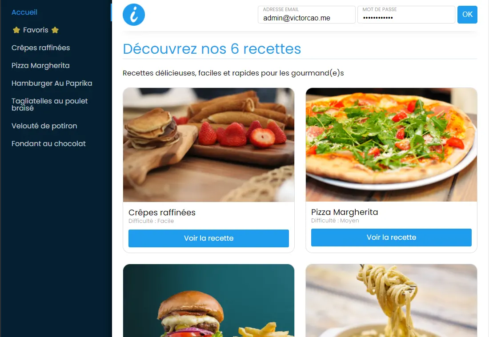

# iCooking - Application de recettes

## Réalisation 

Messagerie instantanée, coder avec React et Redux. Utilisation de Socketio permettant une communication bidirectionnelle en temps réel entre les clients Web et les serveurs.

Site de cuisine mettant en place une liste de recette gratuite. Liste récupérer à travers une API contenant la base de données en fichier Json et la configuration du jeton JWT.

Coder avec la bibliothèque React et Redux. Mise en place des jetons JWT pour l\'authentification.



## Développement

Vous souhaitez exécuter une démo local

- Récupérez et exécutez le serveur suivant :
```bash
git clone https://github.com/viktk/icooking-server
npm install
npm start
url : http://localhost:3000
```

- Récupérez le projet suivant :
```bash
git clone https://github.com/viktk/icooking-viktk
npm install
npm start
url : http://localhost:8080
```
